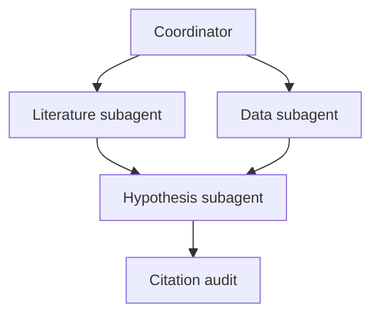
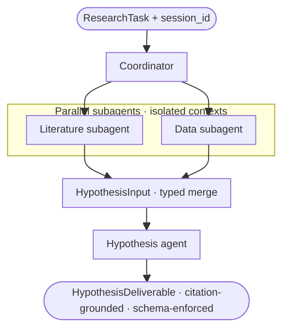

# Claude Agent SDK for NovaMind

Anthropic · Executive briefing for NovaMind CEO / CTO.

**Key considerations:**

- Why the Agent SDK
- Eval framework
- What to build first

---

## NovaMind today — architecture and considerations

NovaMind is a **semi-autonomous research agent** with specialized sub-agents for **literature review**, **data analysis**, and **hypothesis generation**. The team has built **document ingestion** and a **RAG pipeline** for semantic retrieval over **PubMed** articles from roughly the **last ~3 years**. The **data-analysis** agent proactively **validates** themes against the **client’s experimental data**. Early work focuses on **agentic search** and **context management** so **long trajectories** stay coherent and effective.

**Your priorities:**

- They are particularly concerned about **reliability**, **latency**, and **structured outputs** for **production** use.
- They want to understand **migration complexity** and how to run a **fair comparison** against **their current OpenAI stack**.
- **Competitive differentiation** and **product improvement** must be clearly articulated — **“why switch?”** is the central question.
- They care about **speed of evaluation** without disrupting **their roadmap** or **existing customers**.

---

## Part 1 · Three breakpoints in NovaMind-shaped research

NovaMind’s research workflow is not “one long chat.” It is **literature ∥ data → hypothesis → citation-checked Hypothesis deliverable**.

**The Agent SDK harness** is the **productized tool loop** (**`query()`**, event stream, **agent definitions**, tools/MCP, hooks, structured outputs—the same family as **Claude Code**)—**one place** where parallelism, **resume**, and **passage-grounded evidence** stay **enforceable** under tenant and audit load; **below**, three **`ResearchTask`-order** breakpoints, each tied to a single primitive (details follow).

| Breakpoint | What goes wrong without a primitive | Agent SDK harness primitive |
| --- | --- | --- |
| **1 · Parallel lanes** — **shape the work first** | Literature then data **in series** → **45+ min** wall clock though inputs were independent; **or** one parent transcript absorbs every abstract → **context bloat** and brittle merges. | **[Subagents](https://docs.anthropic.com/en/agent-sdk/subagents)** — isolated child runs inside the harness loop; wall time → **max(lit, data)** when legs are independent |
| **2 · Durable job identity** | Deploy or timeout at minute 25 → team **re-runs ~40 PubMed pulls** or loses “what the model saw at step 37.” No stable **audit spine** mid-flight. | **[Sessions](https://docs.anthropic.com/en/agent-sdk/sessions)** — `session_id` per **`ResearchTask`**; **resume**/fork without replaying the corpus |
| **3 · Deliverable tied to retrieved text** | **PMID looks correct in prose** but the **quoted passage doesn’t match** the abstract—or QA only reads the summary, not tool returns. Regulated review can’t tie claims to **retrieved text**. | **[Citations](https://docs.anthropic.com/en/docs/build-with-claude/citations)** + your validators; literature returns **passage-grounded** evidence rows **before** bounded synthesis |

**Walkthrough (same sequencing):** **`query()`** runs the loop; delegate **literature** and **data** as **parallel subagents**, merge **compact JSON handoffs**. When a deploy or timeout hits mid-run → **`resume(session_id)`** without replaying the whole corpus (**durable job**). Evidence rows stay **passage-grounded** for Part 2 graders before the **`Hypothesis` deliverable** ships (**bounded synthesis**).

---

## Part 1 — Primitives glossary

A **`ResearchTask`** is one customer research job—inputs (therapeutic question, sponsor scope), expected **Hypothesis deliverable** JSON, tenant ids, and SLA. Think **one `ResearchTask` → one `session_id` → many tool turns**.

| Primitive | Plain English | Problem it solves | NovaMind use |
| --- | --- | --- | --- |
| **Subagents** | Delegate to a **child** Claude with its own transcript | Parent context drowning in PubMed fan-out | Literature, data, hypothesis, citation audit **lanes** |
| **Sessions** | Save and **resume** multi-step state | Timeouts/deploys force expensive replay | Long PubMed fan-out without “new chat amnesia” |
| **Hooks** | Your code **before/after** tools run | Model proposes unsafe paths/shell; prompts aren’t enforcement | Sandbox paths, audit logs, deny unsafe writes |
| **MCP** | Standard wire-up for **your** tools/data | PHI/SQL in prompts; bespoke REST per squad | PubMed RAG, sponsor tables, Braintrust scorers |
| **Structured outputs** | Schema enforced **across tool turns** | Valid JSON on turn 1, broken pack after 30 tool rounds | **Hypothesis deliverable** after real MCP traffic |

**Models vs primitives:** the **model** is the engine (Opus vs Sonnet vs GPT‑5 on a lane). **Primitives** are the frame—sessions, subagents, MCP, hooks, structured outputs—whether the vehicle is **operable** under tenants, audit, and load. You can upgrade the engine and still fail without the frame.

---

## Part 1 · Latency and routing (production)

**One job, many kinds of work** — A **`ResearchTask`** is not a single “answer this question” moment. It combines **routing and orchestration**, **evidence-heavy retrieval**, **synthesis into a Hypothesis pack**, and **structured output** your stack ingests. Those steps impose **different cognitive loads**—and **different models fit different chores** than one flagship used everywhere. The Agent SDK sets **`model` per agent / lane** so those choices stay **config**, not a monolithic “one brain for the whole product.”

**Claude family (default fit, not scripture—your fixtures decide)** — **Opus**, **Sonnet**, and **Haiku** differ in how much **slow, deep reasoning** vs **cheap, fast coordination** each turn buys you per dollar. **[Claude models overview](https://docs.anthropic.com/en/docs/about-claude/models/overview)** — SKUs, context, pricing.

**The problem** — Board and customers care about **p95/p99** and **$/completed ResearchTask**, not which model wins a short chat benchmark. One SKU everywhere either **over-pays** (Opus on routing) or **under-delivers** (mini on hypothesis).

**Without a productized harness** — Model choice is often welded into monolithic prompts or one global route; hard to tune **per lane** or measure tails on **your** task mix.

**With the Agent SDK** — **`AgentDefinition`** per lane: name, instructions, tools, **`model`**. Route coordinator / literature / hypothesis independently; benchmark TTFT and tails on frozen end-to-end runs (Part 2).

**`AgentDefinition`** holds **each sub-agent’s name, instructions, tools, and model.** **Routing** is which definition runs **coordinator** vs **literature** vs **hypothesis**—coordinator owns **merge and delegation**, not deepest mechanistic science (that stays on hypothesis).

Haiku-class is built for **speed**—we still recommend **TTFT, p50/p95/p99, and tail** on **your** `ResearchTask` mix against any other “small” model you compare to.

**Per-`AgentDefinition` routing** (recommended defaults):

| Agent lane | Model class | Rationale |
| --- | --- | --- |
| **Coordinator** | Sonnet-class | Merge narrative, delegate, own customer-visible quality |
| **Literature** | Sonnet-class | Tool-heavy retrieval + structured evidence JSON |
| **Hypothesis** | Opus-class | Deepest mechanistic reasoning where budget allows |
| **Routing / tags / light extract** | Haiku-class | Cheap structure when rubric says the task is classification-shaped |

---

## Part 1 · Harness vs model — the Agent SDK premise (Messages reality)

**The problem** — NovaMind must keep a **whole research system** governable: dozens of tool rounds, **parallel** literature and data, **Hypothesis deliverable** after real PubMed/sponsor traffic, per-tenant ACLs, and audit—not just “a smarter chat completion.”

**Two questions** — **Messages API:** “Given this **thread**, what should the model say or call **next**?” **NovaMind:** “Given this **`ResearchTask`**, how do we run a **long, tool-heavy, tenant-governed** job to a **repeatable deliverable**?” That second job **does not live inside** `messages.create`—it lives in **everything you wrap around** the API.

**Without a productized harness** — You implement the **`while`**, subagent routing, session persistence, and JSON enforcement on the Messages path—**every** release and lane. A **stronger SKU** sharpens **each turn**; it still does **not** give you **merge**, **retry**, **transcript policy**, **schema under load**, or **audit** for **multi-hour** **`ResearchTask`** work (short benchmarks almost never stress that layer).

**With the Agent SDK** — Same tool loop shape as **Claude Code**, packaged as a library: you **`query()`**, pass agents/tools/hooks/permissions, and **subscribe to events** ([Agent SDK overview](https://docs.anthropic.com/en/agent-sdk/overview))—so depth stays on **PubMed, sponsor, Hypothesis, policy**, not a **home-grown interpreter** for every stream edge case and API churn.

**Coordinator path** — Ingest **`ResearchTask`** → delegate **literature** and **data** subagents when dependencies allow → merge **typed JSON** → **hypothesis** (and **citation audit** where you enforce allowlists) → **Hypothesis deliverable**.

**The loop (every vendor):**

1. Model returns **`tool_use`** (“run PubMed MCP with these args”).
2. **Your process** (or MCP server) executes the tool.
3. **`tool_result`** goes back into the transcript.
4. Repeat until the model stops requesting tools—then finalize structured output.

| Investment | What you’re buying | NovaMind example |
| --- | --- | --- |
| **(1) Model upgrade** | Better reasoning per step | Opus on hypothesis; GPT‑5‑mini on routing |
| **(2) Harness (Agent SDK)** | Operable multi-agent pipeline | Subagents, sessions, MCP, hooks, structured outputs |

| If you stay Messages-centric, you typically own… | With the Agent SDK harness, that work shifts toward… |
| --- | --- |
| **The tool loop** — streaming, recovery, concurrency | **`query()`** + events — you ship **tools / MCP**, not the whole interpreter |
| **Merge, routing, context growth** across lanes | **`AgentDefinition` + subagents** — delegation as **config** |
| **Tenant / tool policy** by hand in app code | **Hooks + permissions** — policy **next to** execution |
| **JSON + observability glue** across long runs | **Structured outputs + sessions** — wired into **your** ops story |

**Next slide** — the same split in **a few lines of code** (not a second catalog).

---

## Part 1 · Harness vs Messages API — who owns the loop? (code)

**Previous slide** — why **`ResearchTask`** work needs a harness beyond **`messages.create`**; **this slide** — the same split in code.

**Contrast** — Same governed research system: run it with a **Messages** `while` loop you maintain, or let the **Agent SDK** run the loop while you configure **agents, hooks, schema, and session**.

<div class="leadership-slide-code-compare">
<div>
<p class="leadership-slide-code-compare-label"><strong>Messages API (you own the loop)</strong></p>
<pre><code class="language-python"># You write and maintain all of this
while True:
    response = client.messages.create(
        model="claude-opus-4",
        messages=messages,
        tools=tools,
    )
    if response.stop_reason == "end_turn":
        break
    elif response.stop_reason == "tool_use":
        # Loop only means "model wants a tool" — not how:
        # spin up a literature subagent, run two tools in parallel,
        # thread/async, merge results: all your logic, here.
        result = execute_tool(response)
        messages.append(result)
        # Full transcript in memory: long runs × dozens of PubMed calls
        # → when is it too big? what do you truncate? how do you
        # preserve the context the model still needs? You decide.
        # Retries, timeouts, routing, session, schema, audit — not
        # hypotheticals: real modules; each breaks when the API shifts.
</code></pre>
</div>
<div>
<p class="leadership-slide-code-compare-label"><strong>Agent SDK (you own the business logic)</strong></p>
<pre><code class="language-python"># SDK runs the loop
result = sdk.query(
    task=research_task,
    agents=[literature_agent, data_agent],
    hooks=[citation_allowlist, audit_logger],
    schema=HypothesisDeliverable,
    session_id=session_id,
)
# You handle: business logic only
# MCP, ACLs, schema, hooks
</code></pre>
</div>
</div>

**Reading the snippets** — **Left:** the API exposes **`stop_reason`**, not routing, parallelism, merges, truncation policy, schema enforcement, or audit—those are **`execute_tool`** + everything around **`messages`**. **Right:** **`query()`** runs the **`while`**; **hooks**, **`session_id`**, **structured schema**, **`AgentDefinition`/subagents live in configuration**, not another bespoke interpreter.

---

## Part 1 · Structured outputs — enforcement with the Agent SDK

**Without the harness** — On **Messages-only**, the **Hypothesis deliverable** is usually validated **after** the tool loop: you scrape or parse the last assistant turn and retry into the same growing transcript. The schema is not **wired into** each step of the job.

**With the Agent SDK** — **[Structured outputs](https://docs.anthropic.com/en/docs/build-with-claude/structured-outputs)** on **`query()`** make your **Hypothesis deliverable** schema part of the **same run** as MCP and subagents—not a bolt-on at export time.

**How enforcement shows up in NovaMind-shaped runs**

- **Schema on the job** — Pass **`schema=HypothesisDeliverable`** (or per-lane handoff types) into **`query()`** so the model is guided to emit **against that contract** inside the orchestration loop, not only in free prose you parse later.
- **At handoff boundaries** — Literature, data, and merge steps can each end in **typed JSON** (**literature complete**, **data complete**, **merge complete**) before the coordinator and hypothesis agent consume them—drift is visible **where it happens**, not only when the final pack fails QA.
- **Retries that respect structure** — Schema misses can be handled as **part of the job lifecycle** (log, alert, targeted retry) instead of blind **“try again”** appended to dozens of tool rounds with no pointer to **which** step broke the contract.

**What you ship** — Customers get a **Hypothesis deliverable** whose shape is **enforced by the harness path you run in production**, aligned with the same **`query()`** loop that carries PubMed and sponsor traffic.

---

## Part 1 · Board mandate — model agnosticism at the harness level

**The problem** — The board fears every new frontier SKU forces a **rewrite**: prompts, routes, PubMed wiring, Hypothesis schema—all coupled to “whatever we shipped last quarter.”

**Without a productized harness** — Model vendor is baked into architecture; swapping GPT‑5 for Gemini or Claude feels like a **new product**, not a config change.

**With the Agent SDK** — **Workflow shape** (subagents, MCP, hooks, sessions, structured outputs) stays fixed; **`AgentDefinition.model`** is a **per-lane parameter** validated on **frozen `ResearchTask` eval** (Part 2).

NovaMind’s board wants **more model-agnostic infrastructure**—**less “one vendor baked into the architecture.”**

**`AgentDefinition.model`** is **per-lane configuration**, not a hardwired “the whole product is vendor X” choice. **Coordinator / literature / data / hypothesis** stay **named agent definitions** with **tools, MCP, hooks, permissions, sessions, structured outputs**—the **shape** of the pipeline. The **model id** on each definition is the **parameter** you change when a better SKU wins on **frozen `ResearchTask` eval**.

**When a better model ships**—from Anthropic, OpenAI, Google, or anyone else—you **change the model field (and validate)**, not **re-architect** delegation, PubMed MCP, sponsor ACLs, or Hypothesis schema wiring.

That is **model agnosticism at the harness level**: swappable engines per lane, stable workflow contracts. **Example:** a new Sonnet-class SKU wins on frozen eval → change **`literature_review.model`** from `claude-sonnet-4-5-20250929` to `claude-sonnet-4-6` (and validate)—**without** rewriting PubMed MCP, sponsor ACL hooks, or Hypothesis schema wiring.

---

## Part 1 · Subagents — specialists without flooding the parent

Think of the **coordinator** as the **engagement lead** and each **subagent** as a **consultant**: they do the messy work in their own notebook and return a **one-page brief**—not the full scratchpad.

| Without subagents | With Agent SDK subagents |
| --- | --- |
| One transcript absorbs every PubMed hit and dataframe preview | **Child** contexts hold fan-out; parent sees **structured handoff** |
| Sequential literature → data → hypothesis | **Parallel** literature ∥ data when independent |
| One system prompt blob for all science | **Per-lane** prompts and **tool allowlists** |



**Reference pipeline:** coordinator → **literature ∥ data** → **hypothesis** → **citation audit** (allowlist verify). See [Subagents](https://docs.anthropic.com/en/agent-sdk/subagents). **`AgentDefinition` fields**: Appendix.

---

## Part 1 · Reliability (A) — Citations API and regulated framing

**The problem** — In regulated literature workflows, QA often reviews **summaries**, not every tool return. Models produce **plausible PMIDs** with **wrong or unsupported passages**—liability when scientists act on the deliverable.

**Without a productized harness** — “Cite your sources” in the system prompt; validators bolted on after the fact; weak link between **claim** and **retrieved span**.

**With the Agent SDK** — **[Citations](https://docs.anthropic.com/en/docs/build-with-claude/citations)** on native paths + **your PubMed MCP corpus** + Part 2 **existence / passage / claim** graders.

For regulated literature, **[Citations](https://docs.anthropic.com/en/docs/build-with-claude/citations)** tie claims to **supplied passages**—not “please cite PMIDs” in the prompt alone.

They ground model text in **retrieved documents** with structured citation metadata—stronger than prompt-only citation hygiene when paired with **your** validators.

Production **PubMed ~3y** stays behind **NovaMind RAG + MCP + ACLs**. **WebFetch** in the SDK illustrates generic web retrieval; it is **not** interchangeable with corpus-backed PubMed production.

---

## Part 1 · Reliability (B) — Adaptive thinking, effort, compaction

**The problem** — Long PubMed fan-out fills context. Teams compress history to save tokens—and **silently drop** passage-level detail citations and regulators need.

**Without a productized harness** — Compaction is “cheaper tokens”; incidents show up as **citation regressions** with no archived tool fingerprints.

**With the Agent SDK** — **[Extended / adaptive thinking](https://docs.anthropic.com/en/docs/build-with-claude/extended-thinking)** as an explicit **budget knob** on hypothesis; **hooks** to **archive-before-compaction** when you enable context management.

**Extended / adaptive thinking** trades **latency and $** for depth on the hardest hypothesis steps. **Compaction** needs **archive-before-summarize** if downstream citations must stay reconstructable.

**[Extended thinking](https://docs.anthropic.com/en/docs/build-with-claude/extended-thinking)**, **[adaptive thinking](https://docs.anthropic.com/en/docs/build-with-claude/adaptive-thinking)**, and **[effort](https://docs.anthropic.com/en/docs/build-with-claude/effort)** shape internal reasoning on newer Sonnet/Opus SKUs—**behavior differs by model version**; see the extended-thinking guide for the SKU you standardize on.

On the **OpenAI compatibility** path, **prompt caching** and **`response_format`** are **not** supported—**citations, structured outputs, caching, and full thinking visibility** belong on **native** Claude APIs with the Agent SDK.

**Compaction:** if you adopt **conversation compaction** (where available), **archive** transcripts and tool-return fingerprints **before** evidence needed for downstream citations could be dropped—same discipline as hooks.

---

## Part 1 · Hooks — production control and audit trail

**The problem** — Model-generated **paths, URLs, and shell** are untrusted input. In pharma, you must **deny-by-code** and **prove what was retrieved** for citation incidents—not “we told the model to be careful.”

**Without a productized harness** — Post-hoc log scraping or one-off middleware; policy drifts from **`allowed_tools`** when tools are renamed.

**With the Agent SDK** — **[Hooks](https://docs.anthropic.com/en/agent-sdk/hooks)** run **first** in permission order: **PreToolUse** blocks bad writes/shell; **PostToolUse** writes audit rows (query, PMIDs, tenant/session ids) so you can reconstruct **what the model saw**.

**Hooks** are **your functions** the SDK calls **before or after** tool use (and at other lifecycle points)—turn “model asked to `Write`” into “**deny** unless path is in `/sandbox`” or “**log** this corpus query to the audit table.”

They complement **`allowed_tools` / `disallowed_tools`**—hooks are where **tenant policy** and **deny-by-code** meet **untrusted model output** (paths, URLs, shell fragments).

**Patterns (illustrative):**

- **`PreToolUse` on `Write` / `Edit` / `Bash`** — normalize paths, enforce a **single sandbox root**, reject `..` and absolute paths outside that root, and cap write sizes where your OS allows. For **shell**, many teams **parse the first token** against an allowlist of interpreters/commands instead of accepting unconstrained **`bash -c`** from the model.
- **`PreToolUse` on outbound tools (optional)** — attach signed metadata, enforce **host allowlists** for `WebFetch`, or require **human approval** for out-of-domain fetches when you run **`default`** mode with interactive `canUseTool`.
- **`PostToolUse` on retrieval / MCP / web** — emit structured audit rows: **tool name**, **tenant and session ids**, **query** (or a **hash** if you must avoid storing raw PHI), **identifiers returned** (PMID, DOI, URL), **latency**, **model SKU**—enough to reconstruct “what the model saw” for **citations** and **post-incident** review without necessarily retaining full payloads forever.
- **`PostToolUse` after mutating tools** — record **paths touched** and **content checksums** or short diffs for forensics.
- **Session lifecycle / compaction** — if you enable **conversation compaction** or similar context management, **archive** transcript slices and **tool-return fingerprints** **before** the runtime drops detail that downstream **Citations** or regulators would need—treat compaction as an explicit **retention and evidence** decision, not silent token savings.

---

## Part 1 · Sessions — why durable state matters

**The problem** — A **`ResearchTask`** is often **multi-hour**: many tool rounds, MCP calls, deploys, operator pauses. Treating each HTTP call as a **new chat** loses the audit trail and forces **expensive replay** of PubMed and sponsor pulls.

**Without a productized harness** — “Resume” means a human-written summary or re-prompting from scratch—lossy for **citations** and compliance.

**With the Agent SDK** — Stable **`session_id`** per job; **`resume`** and **`fork`** without throwing away the tool graph. **Sessions are job identity—not the same as prompt-token cache.**

**What a session is** — A stable **`session_id`** bound to **one job’s transcript and tool graph**—not just conversational memory, but the **audit-relevant skeleton** your **Citations** and incident reviews depend on. Subagents **can** mint their own child context while the coordinator holds the parent **`session_id`** lineage.

**Operations** ([Sessions](https://docs.anthropic.com/en/agent-sdk/sessions))

- **`resume(session_id)`** — After a deploy, timeout, or operator pause, pick up the **same** job on the **same** id: the PubMed pulls, sponsor checks, and tool graph you already paid for stay attached—**without** replaying the corpus from zero.
- **`fork` (where supported)** — Copy the parent session’s history into a **new** branch with a **new** `session_id`. The analyst reuses the **exact evidence already in the transcript** (retrieved abstracts, validated sponsor rows, merge state) and explores a **different hypothesis angle or coordinator strategy**—while the **run that is already bound for the customer** stays untouched on the parent thread. The fork is a **what-if lab**: you do not overwrite the audited parent or silently replace a deliverable in flight; you only promote a branch to production if you explicitly choose to.

---

## Part 1 · MCP — data plane for PubMed, sponsor, and eval

**The problem** — Regulated workflows can’t put **PHI, sponsor SQL, or API keys** in prompts. One-off REST wrappers per squad mean **inconsistent tool shapes**, weak versioning, and eval fixtures that **drift** from production.

**Without a productized harness** — Secrets and ACL logic leak into prompts; each engineer ships a different PubMed route; Braintrust rows don’t match live tool semantics.

**With the Agent SDK** — **[MCP](https://docs.anthropic.com/en/agent-sdk/mcp)** registers **your** servers as named tools (`mcp__<server>__<action>`); the SDK routes **`tool_use`** to the server; auth and row-level rules stay **server-side**.

**Agent mental model:** the model emits **`tool_use`** (“call **`mcp__pubmed-rag__search`** with `{ query, limit }`”); your runtime routes it to an MCP-capable endpoint; the server validates auth, executes against **your corpus or warehouse**, returns **tabular / JSON payloads** plus errors the model must handle.

**Why not one-off REST:** MCP gives a consistent story for **capability advertisement, schemas, versioning, and multi-host routing**—especially when every tenant needs different ACL predicates.

**NovaMind-shaped servers:**

- **PubMed ~3y RAG** — literature lane; ranked chunks/metadata for **Citations** and Part 2 passage graders (your corpus—not generic **WebSearch/WebFetch**).
- **Sponsor cohort readers** — rectangular JSON keyed by **`customer_id`**; secrets never in prompts.
- **`verify_claimed_pmids`** (or equivalent) — citation audit against session allowlist.
- **Braintrust / internal scorers** (optional) — eval rows as MCP tools for in-loop QA when policy permits.

Anthropic **`pubmed@life-sciences`** / NLM connectors are useful **demos**; **tenant-regulated** corpora and Hypothesis gates stay on **your** MCP.

Expose only operations you want automated; throttle and log at the MCP boundary as you would for bespoke HTTP today.

---

## Part 1 · Agent Skills — building reusable domain packages for pharma customers

**What a Skill is** — A **folder** the agent can **load on demand**: mainly **Markdown** instructions and assets (optional small scripts or reference files). **Progressive disclosure**—you avoid pasting dozens of pages of SOP into every prompt. ([Skills](https://docs.anthropic.com/en/agent-sdk/skills))

**Creating a skill is mostly “write docs, drop a folder”** — With the Agent SDK’s **Claude Code–style** workspace config, the convention is a **`SKILL.md`** per skill under **`.claude/skills/<skill-name>/`**. Typical flow:

1. **Add the folder** beside your app (same repo you already ship)—no new service or endpoint.  
2. **Edit `SKILL.md`** — when to use this skill, procedures, checklists, exemplar outputs: the same substance you’d put in an internal playbook.  
3. **Optionally add files** next to it — rubrics, lookup tables, canned query patterns—anything the agent should **read only when** that skill is relevant.  
4. **Version in git** — review, tag, and promote like any other policy artifact; the agent picks it up from **`.claude/`** alongside other project settings.

**Platform reach** — Skills work across **Claude.ai, Claude Code, Agent SDK**, and **Developer Platform**—author once, reuse for **internal** and **customer-facing** agents ([overview](https://docs.anthropic.com/en/agent-sdk/overview)).

**NovaMind example** — A **`drug-discovery-research`**-style skill can package **PubMed patterns**, **evidence rubric**, **citation hygiene**, and **sponsor guardrails**—then **`ResearchTask`** inputs **parameterize** therapeutic area and tenant without forking the whole pack for every deployment.

---

## Part 2 · Step 1 · Four failure modes to measure

Before choosing metrics, agree on what can actually go wrong. NovaMind's pipeline has **four distinct failure modes** — each one has caused or will cause a **customer-visible incident** if left unmeasured. Naming them before the eval starts is what prevents the team from **measuring the wrong things** and drawing the wrong conclusions.

### Failure mode 1 — Structured output drift

The **`Hypothesis` deliverable** JSON is valid on turn **1** and broken on turn **30**. Required fields go missing. Citation passages become **empty strings** that pass schema validation but fail human review. This failure is **invisible to one-shot benchmarks** and only appears under **real tool load**. It happens because after many tool rounds, the model's output distribution is shaped by **accumulated context noise** — not because the model "forgot" the schema, but because **the context changed** what it's likely to produce next.

<hr class="leadership-slide-hr" />

### Failure mode 2 — Citation integrity collapse

The model produces plausible **PMIDs** with passages that **don't match** the source abstract, or omits passages entirely (`"passage": ""`). For NovaMind's biotech customers, a hypothesis with **unverifiable citations** is a **compliance liability**, not a quality issue. This failure mode passes automated schema checks — it only surfaces when a human or compliance reviewer **traces citations** back to their source abstracts.

<hr class="leadership-slide-hr" />

### Failure mode 3 — Long-context synthesis degradation

Over a long **`ResearchTask`** run, cross-paper reasoning degrades — the model loses track of earlier findings, **contradicts** evidence it retrieved earlier in the same session, or produces a hypothesis that doesn't reflect the **totality** of the literature. This failure mode requires **human rubric** scoring on a subset of end-to-end runs. It cannot be fully automated because the failure is about **coherence and scientific soundness**, not schema compliance.

<hr class="leadership-slide-hr" />

### Failure mode 4 — Cost and latency tail risk

A pipeline that produces correct output at **p50** but **times out at p95** is not shippable to pharma customers with **SLA** commitments. One-shot benchmarks don't measure this because they don't run **multi-step trajectories**. Tail risk is where **parallel execution** and **session resume** show their biggest advantage — high-complexity inputs that currently run **sequentially** or require **full replay** on interruption are where the **p95** improvement is largest.

These four failure modes are **measured separately**. A pipeline that scores perfectly on citation grounding but fails on schema reliability has a **specific, diagnosable problem** — it is not a **"79% pipeline."** Averaging across failure modes **hides** the failure mode that matters most for a specific customer or use case.

---

## Part 2 · Step 2 · What to freeze before you run anything

A fair comparison requires holding **every variable constant** except the pipeline under test. If the inputs change between arms, the winner might be **easier conditions**, not a better stack. If scorers are defined **after** seeing results, the eval is **post-hoc rationalization**. Freeze **four things** before the first run.

### The `ResearchTask` rows — `fixtures@v1`

Pull **15–20** rows from NovaMind's existing **Braintrust** eval set. **Stratify deliberately** — do not pull only representative rows:

- **5 high-complexity rows** — large PubMed fan-out (**20+** sources), multi-domain sponsor data, complex hypothesis structure. These are where **p95** latency and context bloat manifest.  
- **5 medium-complexity rows** — representative of typical production load. Baseline comparison.  
- **5 known-failure rows** — inputs where the **GPT‑5.1** pipeline has produced citation errors, schema drift, or incomplete deliverables in **production or QA**. If Agent SDK handles them better, that is the most **credible** evidence; if it doesn't, that's equally important.  
- **3–5 adversarial rows** — stress specific failure modes: high retry probability, optional fields that should be empty vs. fields empty due to drift, malformed tool returns.

Tag this set as **`fixtures@v1`**. **Do not modify** it mid-evaluation. If you need to add rows, tag **`fixtures@v2`** and **rerun every arm** on the new set — do not append to a live catalogue.

<hr class="leadership-slide-hr" />

### The ground truth per row

For each frozen row, **before** running either pipeline, establish: the set of **PMIDs** that are valid sources for this task; expected **citation passages** for at least **3** key claims per row; expected **`HypothesisDeliverable`** structure; and any known anomalies the data subagent should flag. This does not need to be exhaustive — it needs to be **specific enough** that Braintrust scorers make **deterministic** judgments without human review on **every** run.

<hr class="leadership-slide-hr" />

### The MCP tool stance

Both pipelines connect to the **same MCP servers** at the **same versions**. Use **replay snapshots** or **stubs** for the frozen rows so tool behavior is **pinned** — not live corpora that may return different results on different run dates. If a tool is unavailable or returns differently between arms, the comparison is **invalid**.

<hr class="leadership-slide-hr" />

### The scorers

Define **all** scorers in **code** before running either pipeline. A scorer written after seeing results is **not** a scorer — it is rationalization. The **two** scorers below are defined in **Step 4**. **Lock** them, **version** them, run them **identically** on every arm.

---

## Part 2 · Step 3 · The two arms — what each represents

### The two arms

**Arm 1 — Baseline: GPT‑5.1 Messages API**

- Run **as production today** — retries, re-prompt glue, post-hoc validators included (no "cleaned up" fake baseline).
- Tag every baseline run: `arm=messages-api`, `model=gpt-5.1`, `research_task_id` from the frozen row set.

**Arm 2 — Target: Agent SDK parallel specialist pipeline**

- Parallel lit + data subagents → coordinator typed merge → hypothesis; **`session_id`**, **`citation_allowlist`**, **`audit_logger`** on.
- Tag every target run: `arm=agent-sdk`, `model=claude-sonnet` (or per-lane config), `research_task_id` from the frozen row set.

**Optional (Week 2)** — **Gemini 3** in Arm 2's harness; **model** knob only.

---

## Part 2 · Step 4 · Scorers — citation grounding and time-to-valid

### Lock scorers before run 1

- **Scorer** — `output →` one numeric score on one dimension.
- **Two scorers** for this eval — **citation grounding** (compliance) and **time-to-valid** (wall clock to accepted deliverable). Define in **code**, version them, run **identically** on every arm.

<hr class="leadership-slide-hr" />

### Citation grounding rate

- **Failure mode** — plausible **PMID** + **`passage`** that does **not** match the source abstract, or empty **`passage`** that passes JSON.
- **Pass if** — non-empty `passage`, `pmid` in allowlist, `passage` substring of that PMID's abstract. **Score** = fraction of `supporting_evidence` rows passing all three.

```python
def citation_grounding_scorer(output, expected):
    rows = output.get("supporting_evidence", [])
    if not rows:
        return Score(name="citation_grounding", score=0)
    grounded = sum(
        1 for r in rows
        if r.get("passage")
        and r["pmid"] in expected["allowlisted_pmids"]
        and r["passage"] in expected["source_abstracts"].get(r["pmid"], "")
    )
    return Score(name="citation_grounding", score=grounded / len(rows))
```

*Target: ≥ **0.95** on known-good; below **0.80** on any row → stop-ship.*

<hr class="leadership-slide-hr" />

### Time-to-valid

- **Failure mode** — acceptable **p50** but **p95** timeouts or SLA misses on multi-step runs.
- **Measures** — wall clock from `ResearchTask` start to accepted **`HypothesisDeliverable`** (subagents, retries, merge). Report **p50** and **p95** on the frozen set — **p95** is where parallel lanes and resume show up.

```python
def time_to_valid_scorer(output, expected, metadata):
    elapsed = metadata["end_time"] - metadata["start_time"]
    baseline = expected["baseline_seconds"]
    return Score(
        name="time_to_valid",
        score=min(1.0, baseline / elapsed) if elapsed > 0 else 1.0,
        metadata={"elapsed_seconds": elapsed, "p95_flag": elapsed > baseline * 1.5}
    )
```

*Target: match or beat baseline **p50**; **p95** should improve on high-complexity rows.*

<hr class="leadership-slide-hr" />

### Braintrust project setup

One project: **`research-pipeline-eval`**; tag every run with **`arm`**, **`model`**, **`research_task_id`**, **`week`**.

---

## Part 2 · Step 5 · Two-week execution plan

### Pre-work — before Week 1 starts (~1 day)

Pull **`fixtures@v1`** and lock it. Define **ground truth** per row. Stand up **MCP stubs** at pinned versions for both arms. Define **both** Braintrust scorers in code and validate on **2–3 warm-up rows** **not** used in the main evaluation. Confirm both arms complete **one** end-to-end call on a warm-up row **without error** — if either arm cannot pass this **preflight**, stop and fix before Week 1 starts.

<hr class="leadership-slide-hr" />

### Week 1 — Measure and calibrate

*Days 1–2: Sub-test A calibration* — Run each model (**GPT‑5.1**, **Claude Sonnet**, **Claude Opus**, **Gemini 3** if included) against **`HypothesisDeliverable`** in a **single clean prompt** on all frozen rows. Confirms JSON / scoring infra before **Sub-test B**.

*Days 2–4: Sub-test B — literature lane only* — Run **Agent SDK literature subagent alone** on all frozen rows. Score with **citation grounding** only. Fix citation issues **here** before full pipeline — failures caught after four layers are expensive to debug.

*Day 5: Baseline arm full run* — Complete **GPT‑5.1 Messages API** pipeline on all frozen rows. Score with **both** scorers. Establishes baseline numbers. If these differ **materially** from existing Braintrust baselines on the **same rows**, stop — setup is wrong.

*End of Week 1 checkpoint:* Braintrust shows **Sub-test A** for all models, **literature** citation grounding, and **baseline** scores on **citation + time-to-valid**. Leadership sees **pillar trends**, not individual runs.

<hr class="leadership-slide-hr" />

### Week 2 — Full pipeline and decision

*Days 1–2: Full Agent SDK pipeline — Sub-test B* — Complete parallel specialist pipeline on all frozen rows; **both** scorers. Primary production-shaped comparison.

*Day 4: Attribution analysis* — Run **GPT‑5.1 + Agent SDK** and **Claude + Messages API** on frozen rows. **Do not skip** — without it, Week 4 conclusions are not defensible.

*Day 5: Readout preparation* — Compile **two-metric** view: baseline, target, delta, threshold pass/fail on **citation** and **time-to-valid**. Flag rows where target **underperforms** baseline — root cause before any migration recommendation.

<hr class="leadership-slide-hr" />

### What blocks the evaluation and how to handle it

If **MCP stubs** are flaky, **Sub-test B** is noise — fix stubs **before** running. If baseline cannot be run **honestly** (missing prod context, simplified prompts), comparison is **invalid**. If frozen rows are **too easy** (no known-failure cases), add adversarial rows **before Week 2** — not after seeing results. If Week 1 **citation grounding** on literature lane is **below 0.80**, do **not** proceed to full pipeline — fix citations first.

---

## Part 2 · Step 6 · How to read the results and make the decision

### Validate the baseline first

Before comparing arms, confirm **GPT‑5.1 Messages API** scores on frozen rows match existing Braintrust baselines on the **same rows**. A material discrepancy means setup is **not representative** — fix before conclusions.

<hr class="leadership-slide-hr" />

### Read each metric independently

**Do not average** across the two scorers. A pipeline at **0.98** citation grounding but **worse p95** is **not** a **"good enough"** pipeline — it has a **specific latency** failure. Read each metric on its own.

<hr class="leadership-slide-hr" />

### Attribute differences before concluding

Use the **four-configuration** design to separate harness vs model on the dimensions you care about (citation, wall clock). Different findings ⇒ different architecture and migration recommendations.

<hr class="leadership-slide-hr" />

### The two go/no-go signals

*Signal 1 — Citation grounding:* Agent SDK arm ≥ **0.95** on frozen rows, and ≥ baseline on **known-failure** rows. Below threshold: do **not** recommend literature lane migration until root cause is fixed — citation failures are **compliance**, not mere quality.

<hr class="leadership-slide-hr" />

*Signal 2 — Time-to-valid p95:* Agent SDK **p95 ≤ baseline p95** on **high-complexity** rows. If p95 is worse, investigate **parallel overhead** or **retry inflation** — fixable engineering, not automatic abandon.

<hr class="leadership-slide-hr" />

### The three outcomes

*Outcome A — Both signals green* — Recommend Agent SDK pipeline for **Q2** buildout; start **literature** lane (compliance story); existing customers **lane-by-lane**; new pharma on Agent SDK.

<hr class="leadership-slide-hr" />

*Outcome B — Harness signals green, model signals mixed by lane* — Adopt Agent SDK harness everywhere; **`AgentDefinition.model`** per lane from attribution (**GPT‑5.1**, **Claude**, **Gemini 3** where each leads). **Model agnosticism**: harness stable, SKU is **config**.

<hr class="leadership-slide-hr" />

*Outcome C — One signal inconclusive or failing* — **Do not** full re-run. Target the dimension: e.g. add **5–10** known production citation-failure rows and rerun **citation grounding** only; or **profile** p95 regressions on high-complexity rows. **Target uncertainty precisely.**

<hr class="leadership-slide-hr" />

### What the readout is not

It is **not** a **migration vote**. Timeline for which lanes move when is a **separate** conversation **after** evidence exists. The readout answers: **which stack minimizes risk** on the four failure modes that matter for pharma — that **informs** migration; it does **not** replace it.

---

## Part 3 · Recommended first project · Parallel specialist pipeline with typed handoffs

### What this project is and why it's the right starting point

NovaMind's current pipeline is a single agent loop. One model, one conversation, one growing transcript. It retrieves PubMed literature, validates sponsor data, forms a hypothesis, and produces a deliverable — all in sequence, all in the same context window. This architecture has gotten NovaMind to **12 paying customers**. It has **three structural problems** that will compound as NovaMind scales to pharma customers with stricter SLAs and compliance requirements.

The recommended first project addresses all three problems simultaneously — not by rebuilding the pipeline from scratch, but by building a **new parallel-native pipeline alongside the existing one**. The existing **GPT‑5.1** pipeline keeps running unchanged. Existing customers are unaffected. The new pipeline runs on frozen **`ResearchTask`** rows from the **Part 2** eval set, producing directly comparable output that Braintrust scores against the same criteria applied to the baseline.

This is **not a proof of concept** that gets thrown away after the evaluation. Every architectural decision in this build reflects how the production pipeline will need to operate at scale with pharma customers. At the end of **four weeks**, NovaMind has a **validated production template** — something to extend toward **Q2**, not something to evaluate further.

---

## Part 3 · Problem 1 · Sequential execution where parallelism is possible

Literature review and data validation are **independent** tasks. The literature agent doesn't need the data agent's results to start, and the data agent doesn't need the literature agent's results to start. But in a single agent loop, everything runs in order — the model finishes one task before starting the next, because that's the natural shape of a loop. The wall clock cost is **`sum(literature_time + data_time)`**. On a typical **`ResearchTask`**, that's **45+ minutes** for work that could complete in significantly less time if both lanes ran simultaneously.

This is **not a model quality problem**. A smarter model running the same sequential loop produces better outputs on each step but doesn't change the total wall clock time. It's an **architecture problem** — the pipeline isn't structured to exploit the independence of its subtasks.

**How this project addresses it:** literature and data run as **parallel subagents**. A subagent is a separate Claude instance — its own process, its own context window, its own tool allowlist, its own output contract. The coordinator starts both subagents simultaneously when the **`ResearchTask`** arrives. Both run concurrently. The coordinator waits for both to complete before merging their outputs. Wall clock becomes **`max(literature_time, data_time)`** — for a 20-minute literature run and a 15-minute data run, that's **20 minutes** instead of **35**.

The coordinator's role in this design is deliberate: **delegation and synthesis**, not deep reasoning. It receives the **`ResearchTask`**, starts both subagents, collects their typed outputs when both complete, merges them into a validated input for the hypothesis agent, and returns the final deliverable. It does **not** accumulate the raw tool calls that happened inside each subagent's context — it sees only the **compact, structured outputs** they produce when they finish.

---

## Part 3 · Problem 2 · Context accumulation degrades output quality over long runs

In the current pipeline, every tool return lives in the **same growing transcript** — every PubMed abstract, every data payload, every error message from a failed tool call, every retry. After **30–40** tool calls, the model is reasoning over a context that looks nothing like the clean prompts it was benchmarked on. The output distribution shifts in ways that are hard to predict. Required fields start going missing from the structured output. Citation passages become **empty strings** that pass schema validation but fail human review. The merge step becomes brittle because the model is working with too much undifferentiated noise to produce a clean synthesis.

This is the failure mode that **one-shot benchmarks systematically miss**. A model that produces perfect JSON on a clean prompt can produce empty citation passages after 30 tool rounds — not because the model got worse, but because the **context** it's reasoning over has fundamentally different characteristics. Each tool return that enters the context shifts what the model is likely to produce next. At **40 PubMed abstracts** of accumulated context, those shifts compound in unpredictable ways.

**How this project addresses it:** each specialist agent operates in **isolation**. The literature subagent accumulates only PubMed abstracts and their retrieval metadata. The data subagent accumulates only sponsor data and validation results. **Neither ever sees the other's tool returns.** When each subagent completes, it produces a **compact typed handoff** — a structured JSON object containing only the signal, not the noise. The coordinator and hypothesis agent see only these handoffs, not the raw transcripts that produced them. **Context size stays bounded** regardless of how many tool calls happened upstream.

The handoffs are **not summaries or prose** — they are typed, schema-validated objects that encode exactly what the downstream agent needs. The **`LiteratureHandoff`** contains a list of **`EvidenceRow`** objects, each with a PMID, a grounded passage, a relevance score, and a claim. The **`DataHandoff`** contains a list of **`DataFinding`** objects with findings, confidence scores, and supporting statistics. The coordinator merges these into a **`HypothesisInput`** that the hypothesis agent uses to produce the **`HypothesisDeliverable`**. **Each boundary is validated at the point of production.** If a subagent's output drifts from its schema, that's caught at the handoff boundary — not after the full job completes and the deliverable is in the customer's hands.

---

## Part 3 · Problem 3 · No durability when long-running jobs are interrupted

A **`ResearchTask`** is a long job. **40 PubMed** calls, sponsor data validation, hypothesis generation — this takes time, and things go wrong in the middle. A deploy at minute **25** of a **45-minute** run. A container timeout. A network interruption. In the current pipeline there is **no recovery path** — the job restarts from zero, all **40 PubMed** calls happen again, and whatever progress had been made is lost.

At scale with **5 pharma customers** running concurrent **`ResearchTask`** jobs, the probability of at least one interruption per day is not a tail risk to plan around — it is a **planning assumption** to build for. A pipeline with **no session persistence** will fail in production at scale. The question is not whether this will happen but how expensive it is when it does.

There is also a **compliance dimension** to durability that is separate from the operational cost. Pharma customers need to be able to ask: what sources did the model use when it formed this hypothesis? What data did it see? What did it retrieve at each step? Without a durable record of the run, the answer is "we believe it used these sources, based on the final output." That is **not a compliance posture** that survives a regulatory review of a drug discovery hypothesis.

**How this project addresses it:** the full pipeline runs under a stable **`session_id`** that persists across process boundaries. The SDK writes **checkpoints** after each major milestone — literature subagent complete, data subagent complete, coordinator merge complete, hypothesis draft complete. If the job is interrupted at any point, **`resume(session_id)`** picks up from the last checkpoint **without replaying completed steps**. No PubMed calls are re-run. No data validation is repeated. The job continues forward from where it stopped.

Sessions also solve the **audit problem**. Every tool call during the run is logged under the **`session_id`** and **`research_task_id`**. The full trajectory of a **`ResearchTask`** — which sources were queried, which data was validated, what the model saw at each step — is **reconstructable after the fact** as a verifiable record, not as an inference from the final output.

---

## Part 3 · Pipeline design · Graph and schema boundaries

The pipeline has **four agents** with clearly defined roles and validated contracts between them.



Each arrow in this diagram is a **schema boundary** — a point where the SDK validates the output of one agent before it becomes the input of the next. This is what makes the pipeline's failure modes **diagnosable**: when something breaks, you know **which boundary** it crossed and at which step, rather than discovering a broken final output with no trace of where the failure originated.

This pipeline exercises **four SDK primitives**. Each one maps to a specific failure mode in the current pipeline and generates specific evidence for the **Part 2** evaluation.

---

## Part 3 · Pipeline design · Subagents and structured outputs

**Subagents — containment and parallelism**  
The literature and data specialists run in isolated child processes. Each has a declared tool allowlist in its **`AgentDefinition`**: the literature subagent can call PubMed MCP tools only, the data subagent can call sponsor data MCP tools only. Neither can call the other's tools — this is **enforced by configuration**, not by prompt instruction. The coordinator declares both as dependencies and runs them concurrently, waiting for both to complete before merging.

*What this evaluates:* does running each specialist in an isolated context window with bounded tool access actually prevent the schema drift and citation blur that appear in the current pipeline under real tool load? The **Part 2** **citation grounding** scorer on the same frozen rows answers this directly; inspect **`schema_violations_during_run`** in traces when drift is suspected.

**Structured outputs across the trajectory — schema stability under load**  
Every handoff is validated against a Pydantic schema **at the boundary where it's produced** — not just the final output, but every intermediate handoff. **`LiteratureHandoff`** is validated when the literature subagent completes. **`DataHandoff`** is validated when the data subagent completes. **`HypothesisInput`** is validated when the coordinator merges. **`HypothesisDeliverable`** is validated when the hypothesis agent completes.

The **`schema_violations_during_run`** field in the final deliverable counts how many times a boundary failed validation and triggered a retry during the run. **Zero** means the contract held at every boundary throughout the full trajectory. **Non-zero** means drift occurred somewhere and was caught and retried — the field tells you how many times, and the trace tells you at which boundary.

*What this evaluates:* does enforcing the schema at every handoff boundary — catching drift at the step it occurs rather than at the final output — produce meaningfully lower **`schema_violations_during_run`** than the current pipeline on the same frozen inputs? Both arms use the same **`HypothesisDeliverable`** schema; compare the field and traces, not a separate Braintrust scorer.

---

## Part 3 · Pipeline design · Sessions and hooks

**Sessions — checkpoint and resume**  
One **`session_id`** covers the full pipeline run from **`ResearchTask`** ingestion to **`HypothesisDeliverable`** output. Checkpoints are written after each major milestone. In **Week 3**, deliberate interruption tests kill the pipeline at each checkpoint position and verify that **`resume(session_id)`** produces output identical to the uninterrupted run on all deterministic fields.

*What this evaluates:* does the pipeline recover correctly from mid-run failures at each checkpoint, and does the final deliverable match the uninterrupted run? **Week 3** kill/resume tests at **four** milestones prove this; **Part 2** scores **time-to-valid** on uninterrupted runs — a baseline that replays from scratch may look slower without being “wrong.”

**Hooks — enforcement at the tool boundary**  
Two hooks run across the full pipeline. The **`citation_allowlist`** hook fires before every PubMed tool result enters the literature subagent's context. If the PMID is not in the approved source list for this **`ResearchTask`**, the result **never reaches the model** — it cannot be cited because it was never seen. This is categorically different from post-hoc citation checking, which catches the failure after the model has already reasoned from a disallowed source and produced a hypothesis built partly on it.

The **`audit_logger`** hook fires after every tool call across all agents and writes a structured record — tool name, arguments, tenant id, **`research_task_id`**, timestamp — to the OTLP collector. This produces the audit trail that makes post-incident citation reconstruction possible. Not a belief about what the model used. A timestamped log of every source it actually saw.

*What this evaluates:* does moving citation enforcement from a prompt instruction to a pre-execution code check produce meaningfully higher citation grounding rates on the frozen rows? The **Part 2** citation grounding scorer checks this directly — and because both arms use the same allowlist, any difference in grounding rate is attributable to the **enforcement mechanism**, not to different standards.

---

## Part 3 · The schema architecture

The schemas define the pipeline's **contracts before any agent logic is written**. This ordering is not a stylistic preference — it is what makes the dependency graph explicit and the pipeline debuggable.

When **`HypothesisInput`** is declared as requiring both a **`LiteratureHandoff`** and a **`DataHandoff`**, the coordinator's merge step becomes **mechanical**: wait for both, validate both against their schemas, combine them, validate the output against **`HypothesisInput`**. The dependency is encoded in the type structure. There is no coordination logic to misconfigure — the schema enforces the dependency.

If schemas are designed **after** agent logic, they tend to reflect what the agent happens to produce on happy-path inputs rather than what the downstream consumer actually needs. This produces pipelines that work on typical cases and fail on edge cases because the schema was **fitted to the data** rather than the contract defining what the data must be.

The most consequential field across all four schemas is **`passage`** in **`EvidenceRow`**:

```python
class EvidenceRow(BaseModel):
    pmid: str
    passage: str          # non-empty required — empty string fails citation QA
    relevance_score: float
    claim: str
```

An evidence row with an empty **`passage`** is structurally valid JSON. It passes Pydantic validation. It appears in the output as a citation. It is **not a citation** — it is a citation-shaped placeholder. When a pharma customer's compliance reviewer traces it back to the source abstract, they find no passage to verify. This is the **semantic emptiness** failure mode from **Part 2**: present in structure, absent in substance. The **`citation_allowlist`** hook prevents disallowed PMIDs from entering context. The citation grounding scorer checks that **`passage`** is non-empty, that the PMID is allowlisted, and that the passage text actually appears in the source abstract. **All three** conditions must be true for a row to count as grounded.

The **`schema_violations_during_run`** field in **`HypothesisDeliverable`** is the other field worth understanding in detail:

```python
class HypothesisDeliverable(BaseModel):
    research_task_id: str
    tenant_id: str
    hypothesis: str
    supporting_evidence: list[EvidenceRow]
    confidence_score: float
    citations_verified: bool
    schema_violations_during_run: int
```

This field makes the difference between "the pipeline produced a valid final output" and "the pipeline held its contract throughout the run" visible as a number. A pipeline can produce a valid final **`HypothesisDeliverable`** after retrying a failed handoff boundary — and **`schema_violations_during_run`** tells you how many times that happened. A value of **zero** means every boundary held on the first attempt under this input's specific context load. A **non-zero** value means there was drift somewhere in the trajectory that required recovery. Both can produce valid final outputs. Only one did so **without drift**.

*Full Pydantic for all four models — **[Appendix · Part 3 schema reference (full)](#appendix-part3-schema-reference-full)**.*

---

## Part 3 · Four weeks · Weeks 1–2 — foundation and parallel merge

### Week 1 — Foundation: one lane, confirmed

- Wire Agent SDK → existing **PubMed** + **sponsor** MCP; define **four** Pydantic schemas.
- Run **literature subagent alone** on **3–5** frozen **Part 2** rows; score **citation grounding**; confirm **`schema_violations_during_run`** is **0** on happy paths.
- **Exit** — valid **`LiteratureHandoff`**: non-empty **`passage`**, allowlisted PMIDs; MCP **stable** + **instrumented**; schemas **cross-validated**.
- **Why one lane first** — citation/schema bugs here are **days** to fix; after full stack they are **multi-boundary** archaeology.

*Risk:* **MCP flake** misread as model regression — log **MCP vs subagent** separately (**Week 4** attribution).

### Week 2 — Parallel execution and coordinator merge

- Add **data in parallel with** literature; sponsor MCP + allowlists; coordinator → validated **`HypothesisInput`** + **`merge_confidence`**; hypothesis → **`HypothesisDeliverable`**; **E2E** on **all** frozen rows.
- **Exit** — both agents **start together**; coordinator **waits for both** before merge; **four** schema boundaries green; **`merge_confidence`** from a **written formula**, not a placeholder default.
- **Hard triad** — (1) **no merge on first return** alone; (2) **partial fail**: keep completed lit if data dies; (3) define **`merge_confidence` semantics before code** (e.g. min of weighted lit/data confidence).

*Risk:* merge after **first** subagent finishes — log **start / completion** timestamps; verify inter-completion gap in traces.

---

## Part 3 · Four weeks · Weeks 3–4 — durability, evidence, and baseline honesty

### Week 3 — Durability and policy enforcement

- **`session_id`** checkpoints after **four** milestones (lit complete, data complete, merge complete, hypothesis draft); kill + **`resume(session_id)`** at each — **no** replay of finished work; deterministic fields **match** uninterrupted run.
- **`citation_allowlist`** — disallowed PMIDs from MCP stub **never** reach **`LiteratureHandoff`**. **`audit_logger` → OTLP** — structured tool rows with **`research_task_id`** in existing observability.
- **Exit** — clean resume from **all four** kills; allowlist proven; audit visible end-to-end.

*Risk:* **checkpoint gaps** — enumerate **every** session state transition; each is either a tested checkpoint or **replayable** from the nearest upstream one.

### Week 4 — Evidence for the decision

- **Both arms** on **`fixtures@v1`**: **GPT‑5.1 Messages** baseline **vs** Agent SDK specialist; **two** Braintrust scorers (**citation grounding**, **time-to-valid** p50/p95) + **four-configuration** attribution.
- **Analysis week** — pipeline **built**; new defects → backlog unless **stop-ship**: citation below **0.95** on known-good, or **p95** worse than baseline on high-complexity.
- **Honest baseline** — prod prompts, tool access, retry glue **as-shipped**; a prettified baseline **voids** the readout.

*Risk:* baseline without real prod glue — comparison **not credible**.

---

## Part 3 · Week 4 decision — three outcomes and shared truth

The readout answers one question: on the four failure modes that matter for pharma customers, **which stack produces lower risk?** Three outcomes are possible, each with a clear next step.

**Outcome A — Both signals green**  
Citation grounding ≥ **0.95**, time-to-valid **p95** competitive or better on high-complexity rows. Attribution confirms both harness and model contributing where it matters.

The parallel specialist pipeline becomes the **Q2 template**. New pharma customers onboard on the Agent SDK stack from the start. Existing customers migrate **lane by lane** — literature first, because the citation grounding improvement is the most auditable story for compliance reviewers. Each lane migrates only after the evidence supports it for that lane specifically, not all at once.

**Outcome B — Harness signals green, model quality varies by lane**  
Parallelism and session durability show up in **time-to-valid**; citation story may vary by lane. Adopt the **Agent SDK harness** across all lanes immediately. Configure **`AgentDefinition.model`** per lane from attribution data.

**Outcome C — One signal inconclusive or failing**  
One metric fails threshold or returns inconclusive results on the frozen row set. **Do not reset the program.**

Target the specific failing dimension with additional frozen rows from known production failure cases — inputs where the current pipeline has already produced citation errors, schema drift, or incomplete deliverables. Add **5–10** targeted rows and rerun the scorer for the failing dimension only. The pipeline is built and working. Outcome C is a **targeted extension**, not a restart.

**What is true across all three outcomes**  
The pipeline template exists and is validated. The schemas are defined. The MCP connections work. The hooks enforce citation policy and produce audit logs. The sessions checkpoint and resume correctly. **Q2** pharma buildout proceeds with this template regardless of which model runs inside each lane. There is **no outcome** in which the four weeks of work are discarded.

---

## Closing · OpenAI-only vs Agent SDK

**OpenAI-only** (or **Gemini-only**) is a sound choice when **your** harness already delivers **multi-agent isolation, citation-grade governance, and eval coverage** at acceptable cost. The strategic question is whether **delivery on this roadmap** is cheaper as **incremental patches** on that harness or as **Agent SDK** primitives (subagents, hooks, permissions, sessions) that Anthropic ships and evolves as a **product surface**.

**Custom orchestration:** staying on raw chat-completions usually means **you** own **tool loops, audit hooks, session persistence, and per-lane routing**—that is **engineering, SRE, and compliance** cost on top of **$/1M tokens**.

**Public benchmarks:** public leaderboards are **directional**; they rarely mirror **regulated, tool-heavy** **Hypothesis deliverable** work in your product. Treat **your** own **frozen eval rows and board-agreed scoring rubric**—the same cases you already use for release or customer-facing QA—as the authority for go/no-go, not generic benchmark tables.

The Agent SDK supports **different models per subagent** and runs across **supported cloud and direct API routes**—see **[Subagents](https://docs.anthropic.com/en/agent-sdk/subagents)**—so you can **change which SKU powers a lane** (coordinator vs literature vs hypothesis) on evidence without redesigning orchestration every time a frontier model ships. **Workflow + MCP + hooks** stay stable; **GPT‑5.1**, **GPT‑5 / mini**, **Gemini 3**, and Claude remain **engines per lane**—including frozen-task eval before any bet-the-company cutover (**Part 3 Week 4**, **Part 2 failure-mode + scorer design**).

**Compared with hand-rolling on Messages:** **managed multi-turn tool execution**, **first-class** hooks / permissions / sessions / MCP ([Agent SDK overview](https://docs.anthropic.com/en/agent-sdk/overview)).

**NovaMind pilot recap:** **six-slide** Part 2 segment (**failure modes**, **`fixtures@v1`**, **two arms**, **two scorers**, two-week plan, readout) plus **eleven Part 3 slides** — **three structural problems**, **pipeline in three beats** (graph, subagents/structured outputs, sessions/hooks), **schema contracts**, **four-week cadence**, **Week 4 outcomes** — then **GPT‑5.1 Messages** **vs** Agent SDK on the **same frozen rows**.

**Migration resources:** **[Migrating from the OpenAI Agents SDK](https://platform.claude.com/cookbook/claude-agent-sdk-04-migrating-from-openai-agents-sdk)** cookbook + **[notebook](https://github.com/anthropics/claude-cookbooks/blob/main/claude_agent_sdk/04_migrating_from_openai_agents_sdk.ipynb)**.

Teams on **Claude Code** reuse the **same hook / permission / tool-loop mental model** as Agent SDK—most lift is **MCP wiring, ACLs, Hypothesis schema**, not a new harness from scratch. Anthropic **`pubmed@life-sciences`** demos are **NLM-shaped**; NovaMind’s **regulated corpus** stays **custom MCP**.

---

<a id="appendix-part3-schema-reference-full"></a>

## Appendix · Part 3 schema reference (full)

Verbatim shapes referenced from **Part 3 · The schema architecture**.

```python
from pydantic import BaseModel


class EvidenceRow(BaseModel):
    pmid: str
    passage: str          # grounded text — empty string fails citation review
    relevance_score: float
    claim: str


class LiteratureHandoff(BaseModel):
    research_task_id: str
    tenant_id: str
    evidence_rows: list[EvidenceRow]
    source_count: int
    retrieval_metadata: dict


class DataFinding(BaseModel):
    dataset_id: str
    finding: str
    confidence: float
    supporting_statistic: str


class DataHandoff(BaseModel):
    research_task_id: str
    tenant_id: str
    findings: list[DataFinding]
    validation_status: str
    anomalies_flagged: list[str]


class HypothesisInput(BaseModel):
    research_task_id: str
    tenant_id: str
    literature: LiteratureHandoff
    data: DataHandoff
    merge_confidence: float


class HypothesisDeliverable(BaseModel):
    research_task_id: str
    tenant_id: str
    hypothesis: str
    supporting_evidence: list[EvidenceRow]
    confidence_score: float
    citations_verified: bool
    schema_violations_during_run: int
```

---

## Appendix · Built-in Agent SDK tools

| Tool | What it does |
| --- | --- |
| **Read** | Read files in the working directory |
| **Write** | Create new files |
| **Edit** | Precise edits to existing files |
| **Bash** | Shell commands, scripts, git |
| **Monitor** | Watch a background script line-by-line |
| **Glob** | Find files by pattern |
| **Grep** | Search file contents (regex) |
| **WebSearch** | Web search for current information |
| **WebFetch** | Fetch and parse web pages |
| **AskUserQuestion** | Clarifying questions ([user input](https://docs.anthropic.com/en/agent-sdk/user-input)) |

**Read / Write / Edit / Glob / Grep** = workspace; **Bash** = compute; **WebSearch / WebFetch** = open web; **PubMed production** = **your MCP**, not this table.

---

## Appendix · `AgentDefinition` reference

| Field | Purpose |
| --- | --- |
| `description` | When the coordinator should delegate to this agent |
| `prompt` | Lane-specific system instructions |
| `tools` / `disallowedTools` | Allowlist / denylist |
| `model` | `sonnet` / `opus` / `haiku` / `inherit` or full model id |
| `skills` | Preloaded [Skills](https://docs.anthropic.com/en/agent-sdk/skills) packs |
